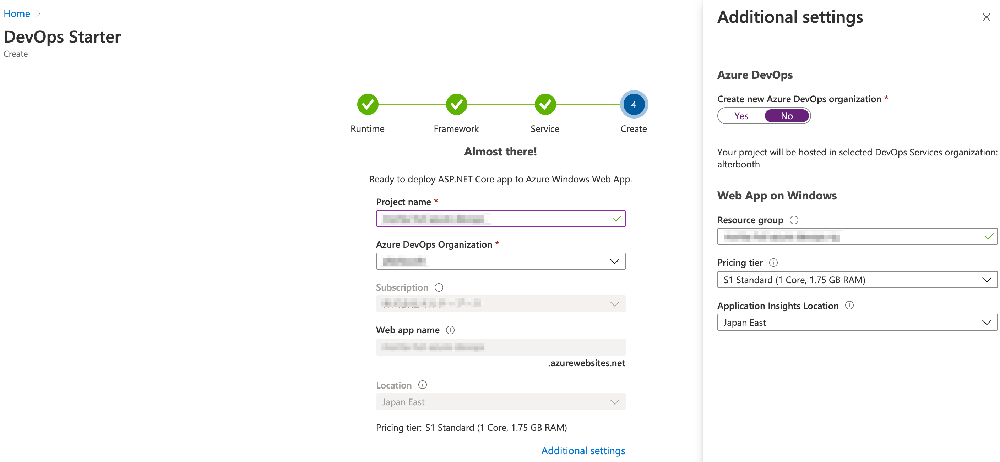
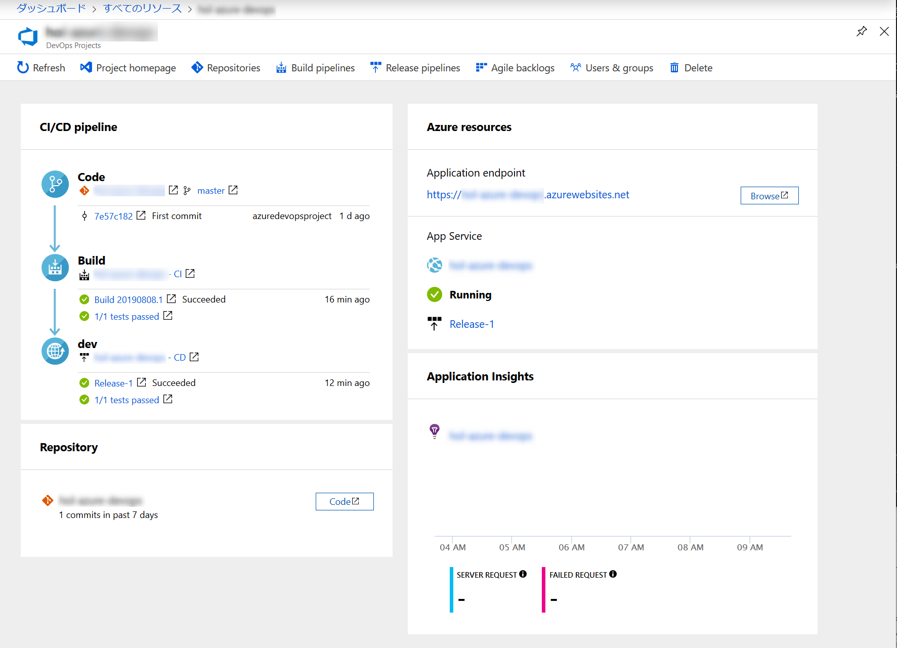
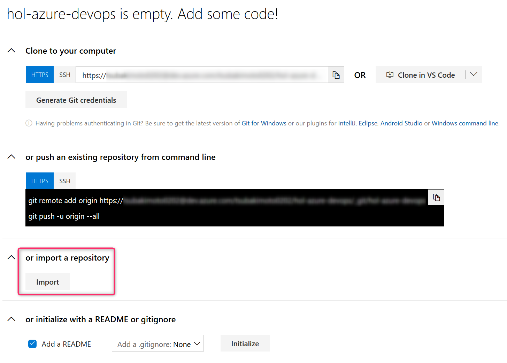
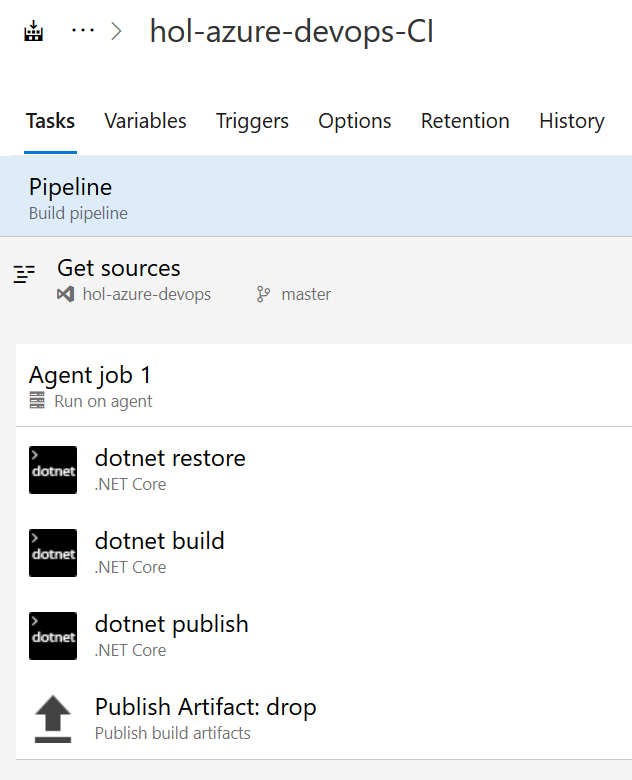
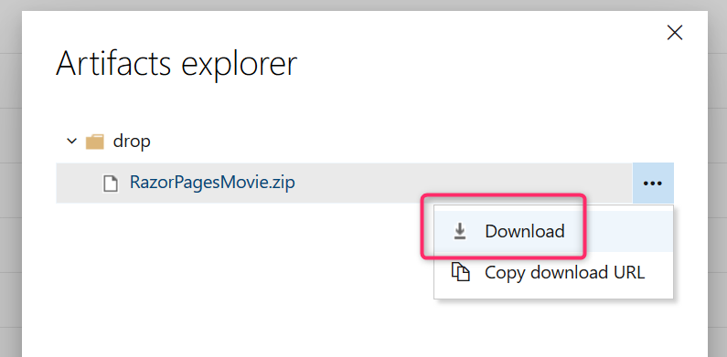

# Azure DevOps を使用したハンズオン
## Azure DevOps とは
[Azure DevOps Services | Microsoft Azure](https://azure.microsoft.com/ja-jp/services/devops/)

## Azure DevOps Projects リソースの作成
**まずはサンプルのプロジェクトを作ってみましょう。**

[Microsoft Azure ポータル](https://portal.azure.com/)にサインインする。  
このときハンズオンで使用するメールアドレスおよびパスワードでサインインすること。

下記のドキュメントを参考に Azure DevOps Projects リソースを作成する。  
入力項目はユニークである必要があるためチェックマークがつく内容を入力する必要がある。  
[Quickstart: Create a CI/CD pipeline for .NET with Azure DevOps Projects | Microsoft Docs](https://docs.microsoft.com/en-us/azure/devops-project/azure-devops-project-aspnet-core)

Azure DevOps Projects リソースが作成できたらメニューの [すべてのリソース] から [DevOps Project] という種類のリソースを選択する。  
サンプルのソースコードを用いた各種パイプラインや Web サーバーが構築されるため、作成された Web ページにアクセスしてみる。

## 独自のプロジェクトの作成
下記の構成で Azure DevOps Projects リソースを作成する。

- Bring your own code
- Code repository : Other Git
    - Repository URL : https://github.com/alterbooth/hol-aspnetcore-sample.git
    - Branch : master
    - Private repository : No
- Is app Dockerized : No
- Select application framework : ASP.NET Core
- Windows Web App
- 上記以外の項目はチェックマークがつく内容を入力すること

### 設定の確認
作成した Azure DevOps Projects リソースに移り [Project homepage] から Azure DevOps にアクセスする。  
プロジェクトの設定にて下記の機能が有効になっていることを確認する。

- Boards
- Repos
- Pipelines
- Artifacts
- Test plans

## Issue1 : ソースコードの準備
### チケットの作成
Boards のカンバンにアクセスし、下記の Issue を作成する。

- 列 : `To Do`
- タイトル : `Gitリポジトリをインポートする`
- アサイン : 自分

### 作業の開始
先ほど作成した Issue を Doing に動かす。  
Repos にアクセスし、下記の Github リポジトリをインポートする。  
https://github.com/alterbooth/hol-aspnetcore-sample.git

インポートに成功したら Issue を Done に動かすこと。

## Issue2 : パイプラインの作成
### チケットの作成
Boards のカンバンにアクセスし、下記の Issue を作成する。

- 列 : `To Do`
- タイトル : `ビルドパイプラインを作成する`
- アサイン : 自分

### 作業の開始
先ほど作成した Issue を Doing に動かす。  
Pipelines > Builds にアクセスし、 ASP.NET Core のビルドパイプラインを作成する。

1. [New pipeline] をクリックする
1. [Use the classic editor] をクリックする
1. インポートしたリポジトリをソースに指定する
1. テンプレートは選ばず [Empty job] をクリックする
1. [Agent job 1] に下記のタスクを追加する
    - `dotnet restore`
        - Path to project : `**/*.csproj`
    - `dotnet build`
        - Path to project : `**/*.csproj`
        - Arguments : `--configuration Release`
    - `dotnet publish`
        - Arguments : `--configuration Release --output $(build.artifactstagingdirectory) -r win-x86,win-x64 --self-contained true`
    - Publish build artifacts
        - 設定変更不要
1. master ブランチへのプッシュをトリガーとする
    - [Triggers] > [Enable continuous integration]
1. パイプラインを保存する
    - [Save & queue] > [save]
1. [Queue] をクリックしパイプラインを手動実行する
1. ビルドパイプラインが成功したことを確認する

### 成果物の確認
成功したビルドパイプラインの結果にアクセスし [Artifacts] > [drop] > [RazorPagesMovie.zip] をダウンロードする。

ダウンロードしたZipファイルを展開し `RazorPagesMovie.exe` を実行する。  
Webサーバーが起動するため `http://localhost:5000/movies` にアクセスし、データの参照や登録ができることを確認する。

アプリケーションの動作確認を行ったら Issue を Done に動かすこと。

## Issue3 : ソースコードの変更
### チケットの作成
Boards のカンバンにアクセスし、下記の Issue を作成する。

- 列 : `To Do`
- タイトル : `ソースコードを変更する`
- アサイン : 自分

### 作業の開始
#### 開発作業を行う
先ほど作成した Issue を Doing に動かす。  
Issue を開き [Create a new branch] からブランチを作成する。

作成したブランチにてファイルを修正し、変更をコミットする。  
このときコミットメッセージに `#3` を含め [Work items to link] にて Issue3 を指定すること。

再び Issue3 にアクセスし、 Issue とブランチが紐付けされていることを確認する。

#### プルリクエストを作成する
Issue3 を開き [Create a pull request] から master ブランチへのプルリクエストを作成する。  
このとき Reviewers に自分を指定すること。

プルリクエストにて差分の確認を行い Approve および Complete でマージを実行する。

#### ビルドパイプラインを確認する
Issue2 にて作成した Pipelines にアクセスし、プルリクエストのマージをトリガーとしたビルドパイプラインが自動実行されたことを確認する。

ビルドパイプラインにてエラーが発生した場合は必要な修正を行うこと。

### 成果物の確認
Issue2 と同様に、ビルドパイプラインから [RazorPagesMovie.zip] をダウンロードし、展開する。  
アプリケーションを実行し変更が正しく反映されていることを確認したら Issue を Done に動かすこと。

## Issue4 : 自動リリースの構成
### チケットの作成
Boards のカンバンにアクセスし、下記の Issue を作成する。

- 列 : `To Do`
- タイトル : `Azure Web Appにデプロイする`
- アサイン : 自分

### 作業の開始
先ほど作成した Issue を Doing に動かす。

Pipelines > Release > Create new release  
テンプレートに [Azure App Service deployment] を指定する。  
Artifacts には先ほど作成したビルドパイプラインを指定する。  
Stage のタスクにてデプロイ先となる Azure サブスクリプションと App Service 名を指定する。

リリースパイプラインが用意できたらソースコードの変更を行い、 master ブランチにコミットする。  
自動ビルドおよび自動デプロイが終了し、アプリケーションに変更が正しく反映されていることを確認したら Issue を Done に動かすこと。

## チーム開発
複数人での DevOps を体験するために複数人のチームを組み、一人の Organization に他のメンバーを招待し、本ハンズオンを再度実施してみる。

## より本格的に Azure DevOps を使ってみる
[Azure DevOps Demo Generator](https://azuredevopsdemogenerator.azurewebsites.net/) を使用して、自身の Organization にデモデータを作成してみる。  
Boards, Repos, Pipelines にどのようなデータや定義が用意されているかを確認する。

## 後片付け
ハンズオンで作成した Azure Web App を含むリソースグループを削除する。