# Azure DevOps を使用したハンズオン

## Azure DevOps とは

[Azure DevOps Services | Microsoft Azure](https://azure.microsoft.com/ja-jp/services/devops/)

## Azure DevOps Starter リソースの作成

**まずはサンプルのプロジェクトを作ってみましょう。**

[Microsoft Azure ポータル](https://portal.azure.com/)にサインインする。
このときハンズオンで使用するメールアドレスおよびパスワードでサインインすること。

下記のドキュメントを参考に Azure DevOps Starter リソースを作成する。
入力項目はユニークである必要があるためチェックマークがつく内容を入力する必要がある。  

- [クイック スタート:Azure DevOps Start er を使用して .NET 用 CI/CD パイプラインを作成する | Microsoft Docs](https://docs.microsoft.com/ja-jp/azure/devops-project/azure-devops-project-aspnet-core)

※「Azure DevOps と Azure サブスクリプションを構成する」までを行う。

作成された Azure DevOps Starter リソースでは、サンプルのソースコードを用いた各種パイプラインや Web サーバーが構築されるため、 Web ページにアクセスし表示を確認する。

## 独自のプロジェクトの作成

新たに下記の構成で Azure DevOps Starter リソースを作成する。

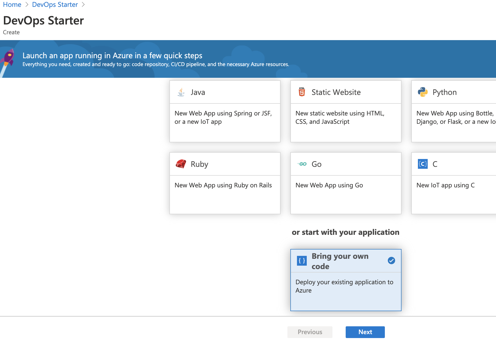

- Bring your own code

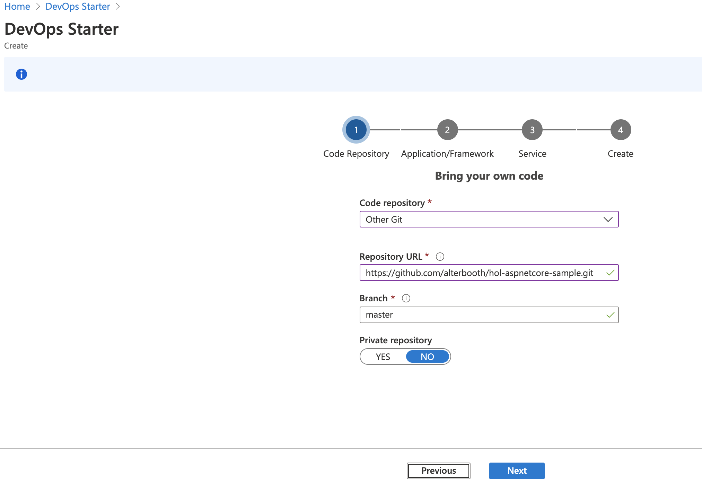

- Code repository : Other Git
  - Repository URL : <https://github.com/alterbooth/hol-aspnetcore-sample.git>
    - Branch : master
    - Private repository : No

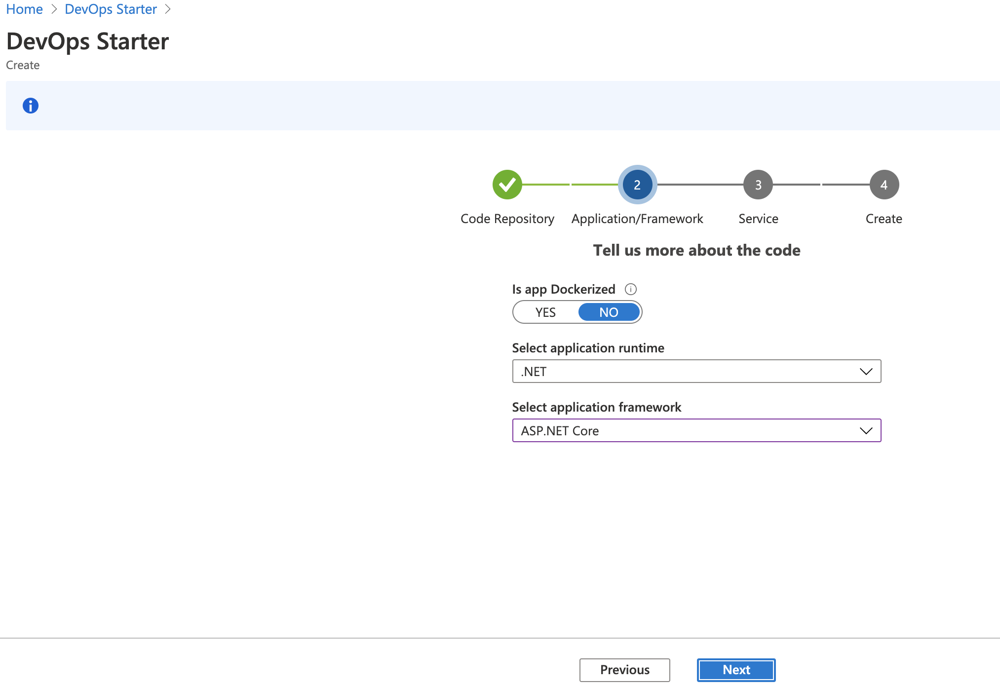

- Is app Dockerized : No
- Select application framework : ASP.NET Core

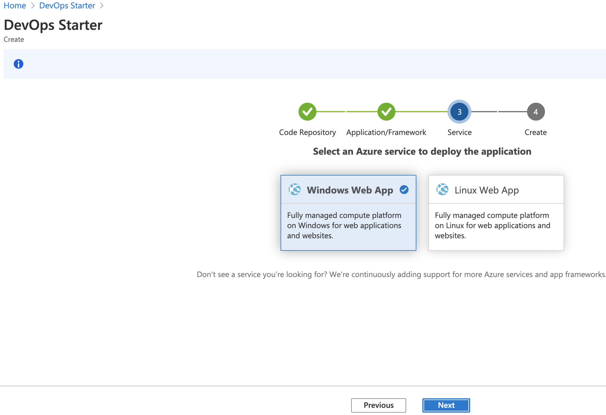

- Windows Web App

- 上記以外の項目はチェックマークがつく内容を入力すること

### 設定の確認

作成した Azure DevOps Starter リソースに移り [Project homepage] から Azure DevOps にアクセスする。  
プロジェクトの設定にて下記の機能が有効になっていることを確認する。

- Boards
- Repos
- Pipelines
- Artifacts
- Test plans

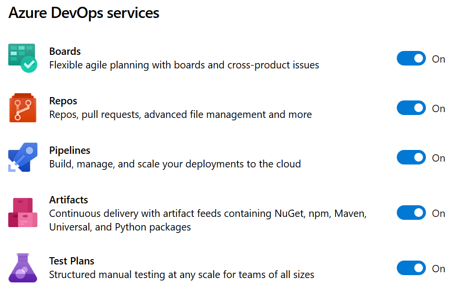

## Work Items の作成

### Feature の作成

Boards > Work items > New Work Item > Feature を作成する。

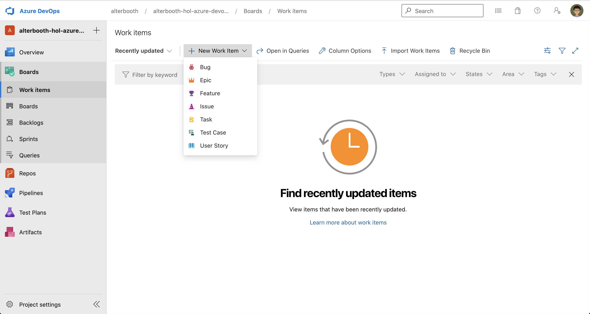

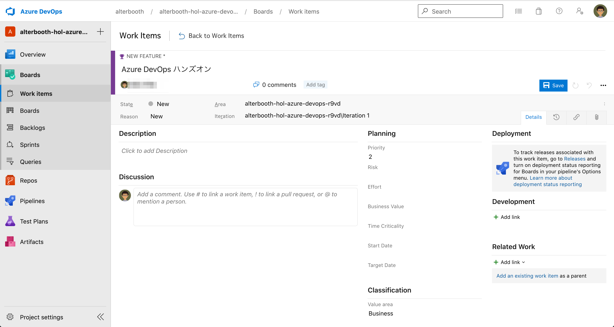

- Title : `Azure DevOps ハンズオン`
- Assign : 自分
- Iteration : Iteration 1

### User Story の作成

Boards から先ほど作成した Feature を開く。

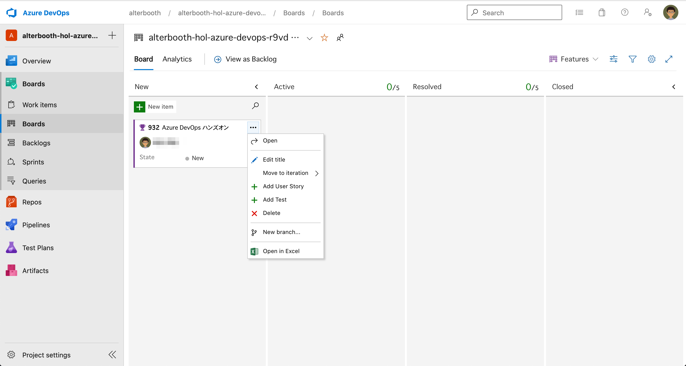

下記の User Story を追加する。

- `Azure Web App にコードをデプロイする`

先ほど作成した User Story が Boards に表示されていることを確認する。

### Task の作成

先ほど作成した User Story に Task を追加する。

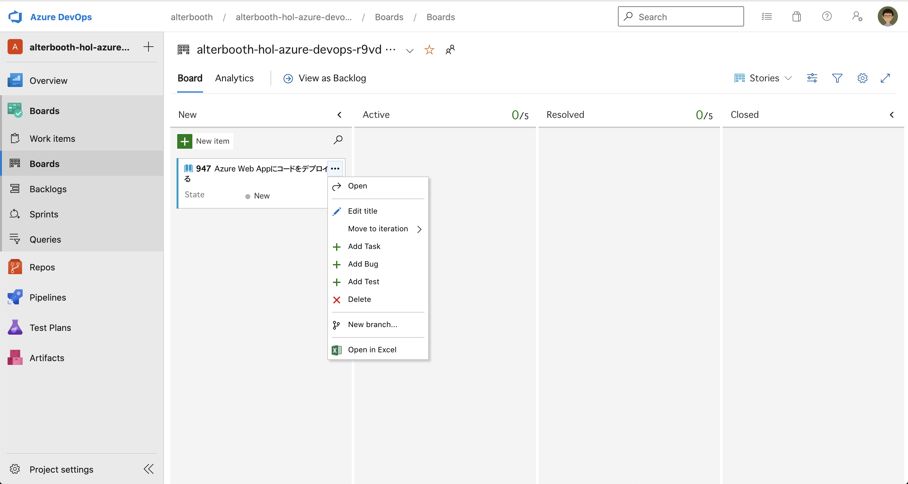

- `Gitリポジトリをインポートする`
- `ビルドパイプラインを作成する`
- `ソースコードを変更する`
- `自動リリースを構成する`
- `Blue-Greenデプロイメント`

先ほど作成した Tasks が Sprints に表示されていることを確認する。

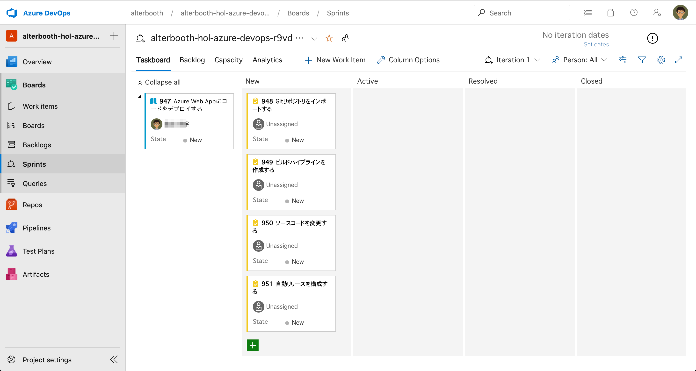

## User Story : Azure Web App にコードをデプロイする

先ほど作成した User Story を Active に動かす。

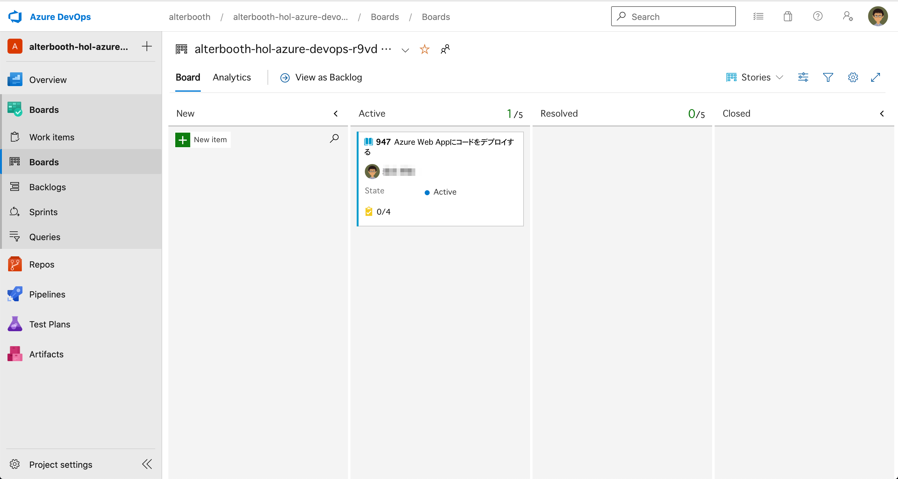

### Task 1 : Gitリポジトリをインポートする

Task を Active に動かす。

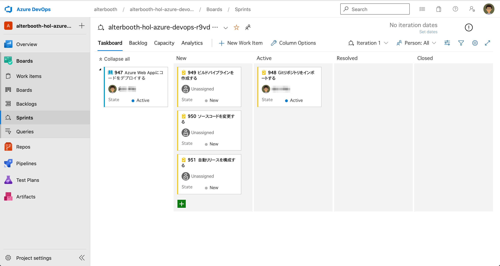

Repos にアクセスし、下記の Github リポジトリをインポートする。  

<https://github.com/alterbooth/hol-aspnetcore-sample.git>

インポートに成功したら Task を Closed に動かすこと。

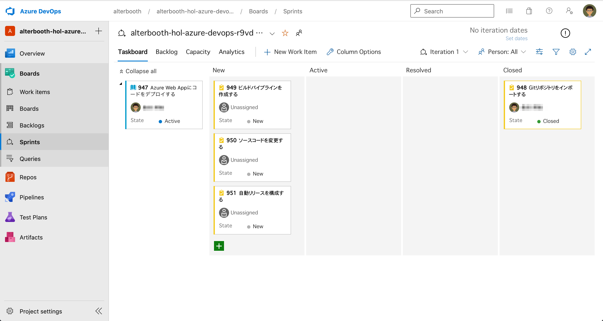

### Task 2 : ビルドパイプラインを作成する

Task を Active に動かす。

Pipelines > Builds にアクセスし、 ASP.NET Core のビルドパイプラインを作成する。

1. [New pipeline] をクリックする
2. [Use the classic editor] をクリックする
3. インポートしたリポジトリをソースに指定する
4. テンプレートは選ばず [Empty job] をクリックする
5. 下記のタスクを追加する
    - `dotnet restore`
        - Path to project : `**/*.csproj`
    - `dotnet build`
        - Path to project : `**/*.csproj`
        - Arguments : `--configuration Release`
    - `dotnet publish`
        - Arguments : `--configuration Release --output $(build.artifactstagingdirectory) -r win-x86 --self-contained true`
    - Publish build artifacts
        - 設定変更不要
6. master ブランチへのプッシュをトリガーとする
    - [Triggers] > [Enable continuous integration]
7. パイプラインを保存する
    - [Save & queue] > [save]
8. [Queue] をクリックしパイプラインを手動実行する
9. ビルドパイプラインが成功したことを確認する

**成果物の確認**

成功したビルドパイプラインの結果にアクセスし [published] から Zip ファイルをダウンロードする。

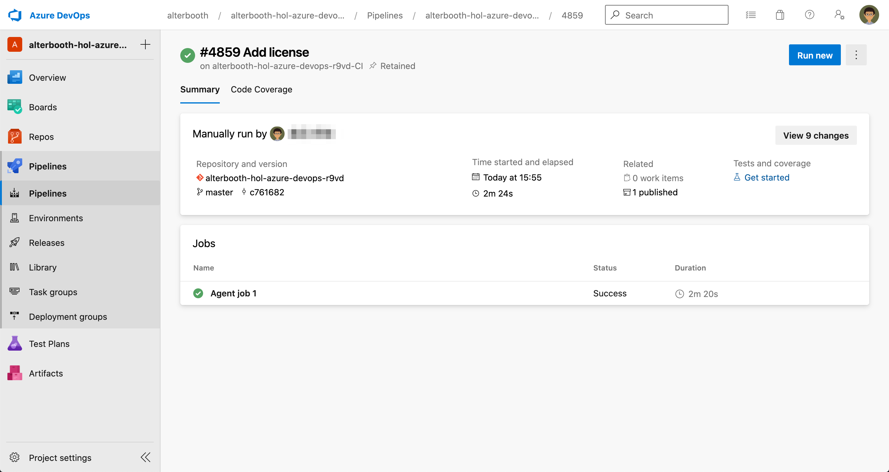
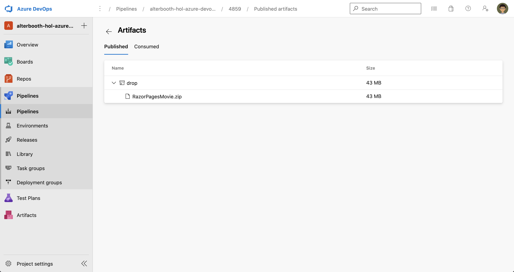

- ダウンロードしたZipファイルを展開し `RazorPagesMovie.exe` を実行すると Web サーバーが起動する。  
- `http://localhost:5000/movies` にアクセスし、データの参照や登録ができることを確認する。
- アプリケーションの動作確認を行ったら Task を Closed に動かすこと。

### Task 3 : ソースコードを変更する

**開発作業を行う**

Task を Active に動かす。

Task を開き [Create a branch] からブランチを作成する。

作成したブランチにてファイルを修正し、変更をコミットする。  
このときコミットメッセージに `#<Task ID>` を含め [Work items to link] にて Task 3 を指定すること。

再び Task 3 にアクセスし、 Task とブランチが紐付けされていることを確認する。

**プルリクエストを作成する**

Task 3 を開き [Create a pull request] から master ブランチへのプルリクエストを作成する。  
このとき自分をレビューアーに指定すること。

プルリクエストにて差分の確認を行い、承認およびマージを実行する。

**ビルドパイプラインを確認する**

Task 2 にて作成したパイプラインにアクセスし、プルリクエストのマージをトリガーとしたビルドパイプラインが自動実行されたことを確認する。  
ビルドパイプラインにてエラーが発生した場合は必要な修正を行うこと。

**成果物の確認**

- Task 2 と同様に、ビルドパイプラインから Zip ファイルをダウンロードし、展開する。  
- アプリケーションを実行し変更が正しく反映されていることを確認する。
- 確認を行ったら、Task を Closed に動かす。

### Task 4 : 自動リリースを構成する

Task を Active に動かす。

**パイプラインの設定**

Pipelines > Release > New release pipeline

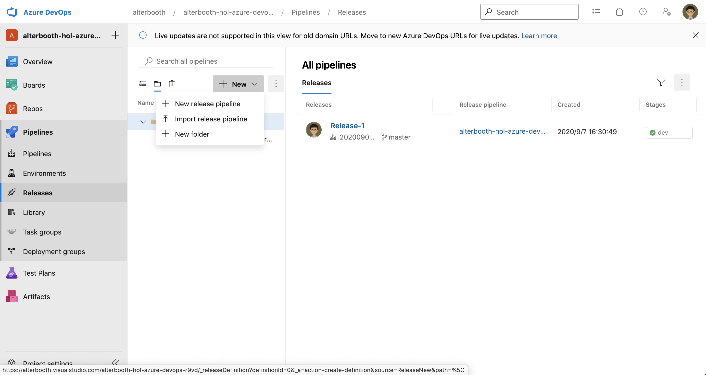

テンプレートに [Azure App Service deployment] を指定する。  

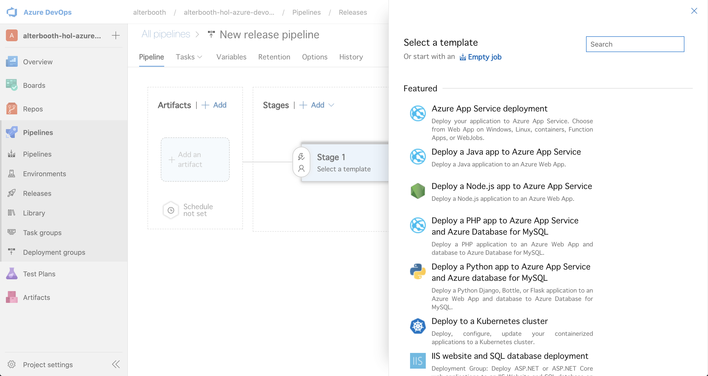

Artifacts には先ほど作成したビルドパイプラインを指定する。  

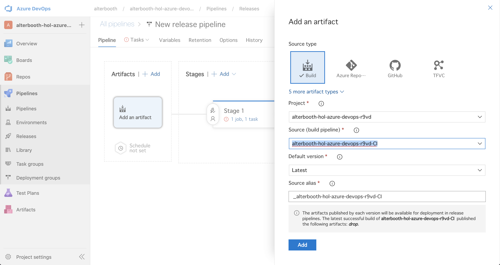

Stage のタスクにてデプロイ先となる Azure サブスクリプションと App Service 名を指定する。

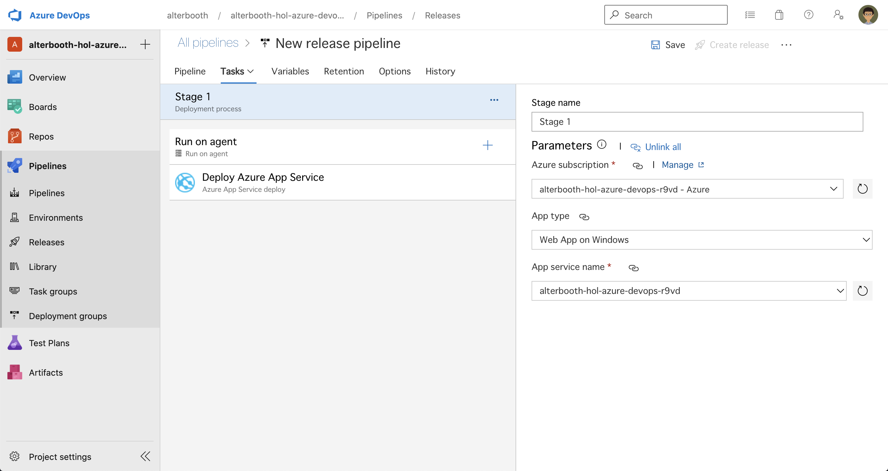

**デプロイを確認する**

- リリースパイプラインが用意できたらソースコードの変更を行い、 master ブランチにコミットする。  
- 自動ビルドおよび自動デプロイが終了し、アプリケーションに変更が正しく反映されていることを確認する。
- 確認を行ったら、Task を Closed に動かす。

### Task 5 : Blue-Green デプロイメント

Task を Active に動かす。

**スロットを追加する**

Azure ポータルに戻り、Azure DevOps Starter リソースの \[App Service\] から Web App リソースへ移動します。

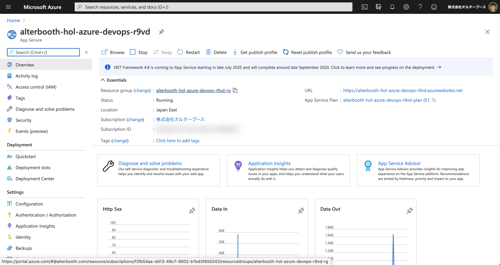

\[Deployment Slot\] からスロットを追加します。

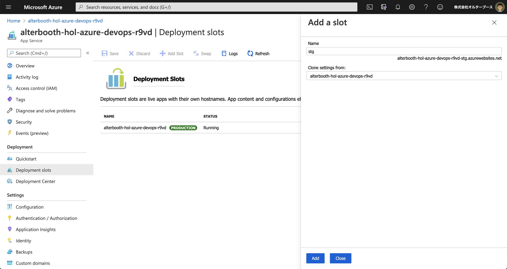

追加したスロットを確認します。

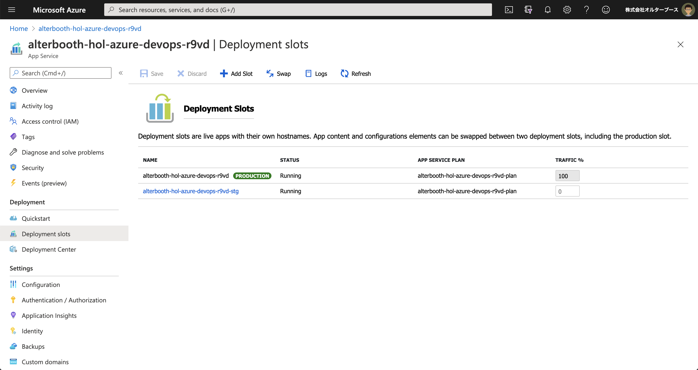

追加したスロットの Web ページにアクセスし表示を確認する。

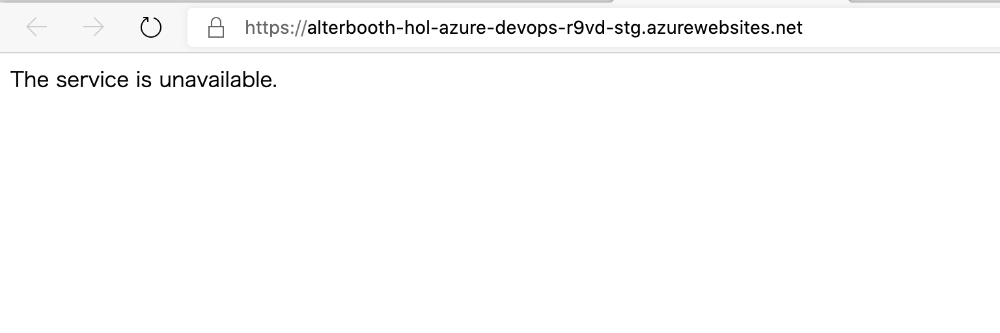

**スロットにデプロイする**

Task 4 の自動リリースの設定を変更して、スロットを使う構成にリリース定義を変更します。

Task 4 で作成したリリース定義を選択して \[Edit\] から変更します。
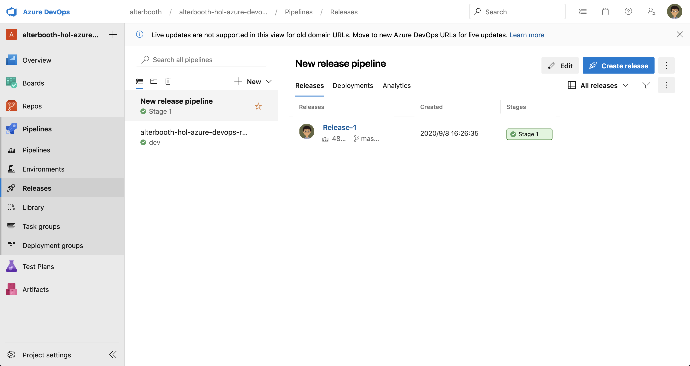

\[Delete\] で Stage を削除します。
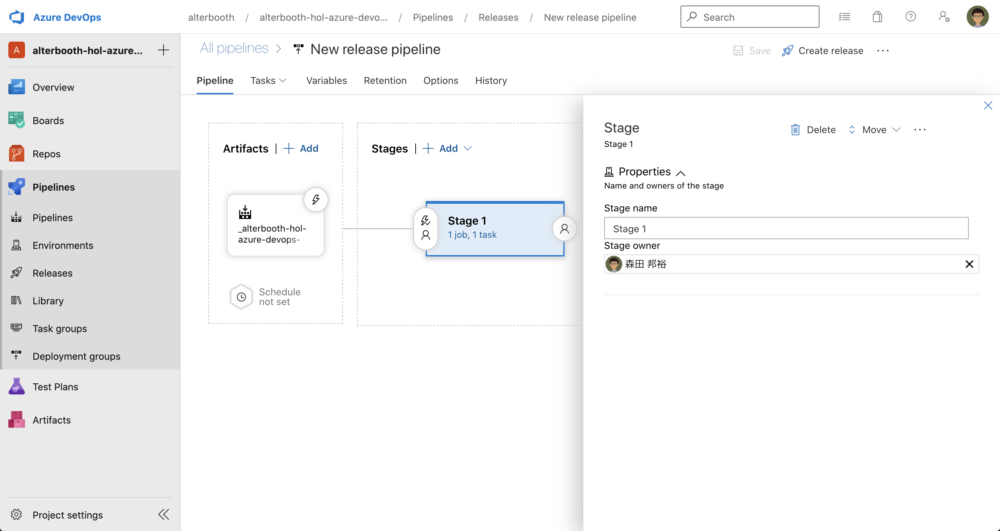

\[New stage\] で新たに Stage を作成します。
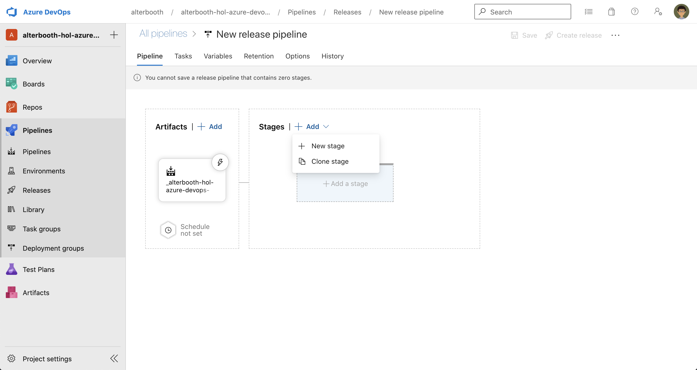

\[Search\] から "slot" で検索し、 テンプレートに \[Azure App Service deployment with slot\] を指定します。
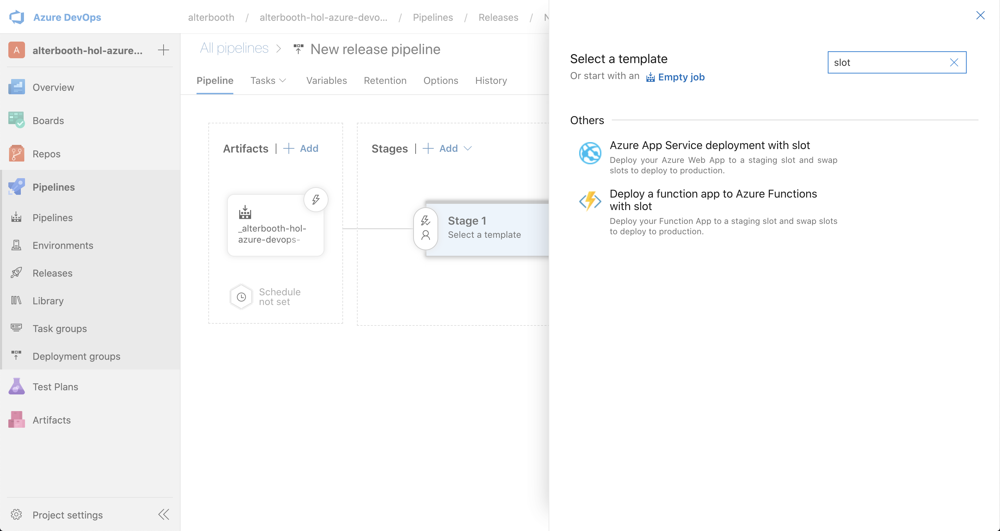

Stage のタスクにてデプロイ先となる Azure サブスクリプションと App Service 名、リソースグループ名、スロット名を指定する。

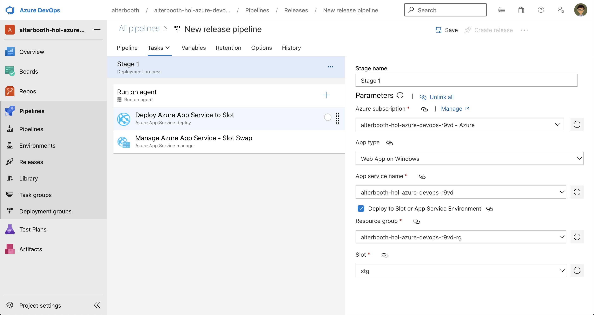

**デプロイを確認する**

- リリースパイプラインが用意できたらソースコードの変更を行い、 master ブランチにコミットする。
- 自動ビルドおよび自動デプロイが終了し、アプリケーションに変更が正しく反映されていることを確認する。
- 追加したスロットの Web ページにアクセスし、**ソースコードを変更する前の表示**を確認する。
- 確認を行ったら、Task を Closed に動かす。

**参考ドキュメント**

- [デプロイのベスト プラクティス - Azure App Service | Microsoft Docs](https://docs.microsoft.com/ja-jp/azure/app-service/deploy-best-practices#use-deployment-slots)
- [ステージング環境を設定する - Azure App Service | Microsoft Docs](https://docs.microsoft.com/ja-jp/azure/app-service/deploy-staging-slots)
- [App Service のデプロイ スロットを使ってテストとロールバック用に Web アプリのデプロイをステージングする - Learn | Microsoft Docs](https://docs.microsoft.com/ja-jp/learn/modules/stage-deploy-app-service-deployment-slots/)

## チーム開発

複数人での DevOps を体験するために複数人のチームを組み、一人の Organization に他のメンバーを招待し、本ハンズオンを再度実施してみる。

## Microsoft Learn の Azure DevOps ラーニングパス

- [Azure DevOps ラーニング パスでアプリケーションをビルドする - Learn | Microsoft Docs](https://docs.microsoft.com/ja-jp/learn/paths/build-applications-with-azure-devops/)
- [DevOps プラクティスのラーニング パスを発展させる - Learn | Microsoft Docs](https://docs.microsoft.com/ja-jp/learn/paths/evolve-your-devops-practices/)

## より本格的に Azure DevOps を使ってみる

[Azure DevOps Demo Generator](https://azuredevopsdemogenerator.azurewebsites.net/) を使用して、自身の Organization にデモデータを作成してみる。  
Boards, Repos, Pipelines にどのようなデータや定義が用意されているかを確認する。

## 後片付け

ハンズオンで作成した全てのリソースグループを削除する。
