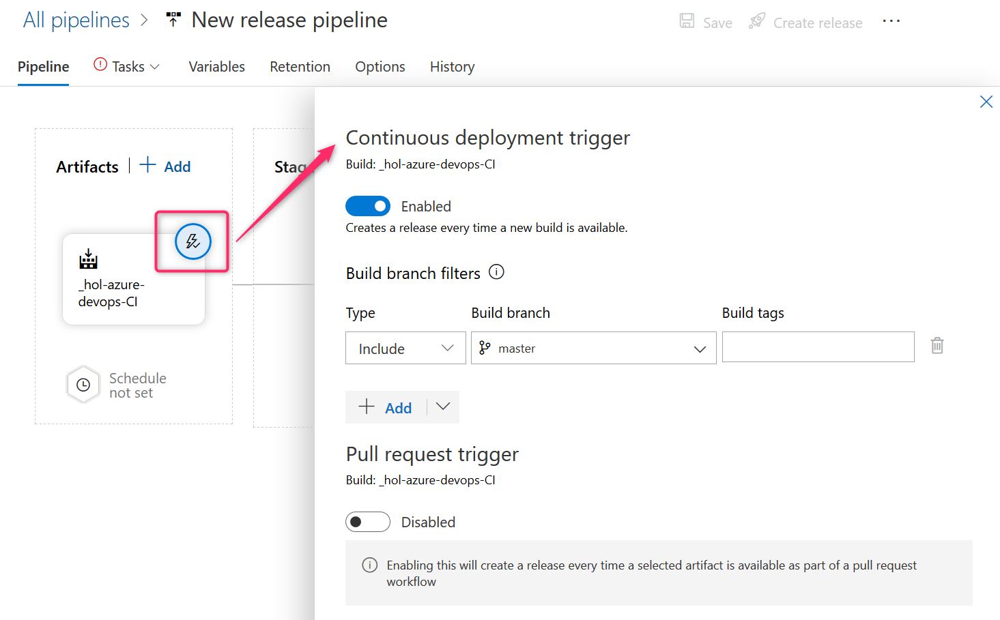

# Azure DevOps を使用したハンズオン
## 事前準備
下記のページを参考に Microsoft アカウントを作成すること。  
[新しい Microsoft アカウントを作成する方法](https://support.microsoft.com/ja-jp/help/4026324/microsoft-account-how-to-create)

## Azure DevOps とは
[Azure DevOps Services | Microsoft Azure](https://azure.microsoft.com/ja-jp/services/devops/)

## Azure DevOps アカウントの取得
[Azure DevOps Services | Microsoft Azure](https://azure.microsoft.com/ja-jp/services/devops/) にアクセスし「無料で始める」から Azure DevOps アカウントの取得する。  
  

Azure DevOps アカウントを取得すると自動的に組織（Organization）が作成される。

## プロジェクトの作成
下記の構成でプロジェクトを作成する。

- Project name : `hol-azure-devops`
- Visibility : Private
- Advanced
    - Version control : Git
    - Work item process : Basic

### 設定の確認
作成したプロジェクトの設定にて下記の機能が有効になっていることを確認する。

- Boards
- Repos
- Pipelines
- Artifacts
- Test plans

## Issue1 : ソースコードの準備
### チケットの作成
Boards のカンバンにアクセスし、下記の Issue を作成する。

- 列 : `To Do`
- タイトル : `Gitリポジトリをインポートする`
- アサイン : 自分

### 作業の開始
先ほど作成した Issue を Doing に動かす。  
Repos にアクセスし、下記の Github リポジトリをインポートする。  
https://github.com/alterbooth/hol-aspnetcore-sample.git

インポートに成功したら Issue を Done に動かすこと。

## Issue2 : パイプラインの作成
### チケットの作成
Boards のカンバンにアクセスし、下記の Issue を作成する。

- 列 : `To Do`
- タイトル : `ビルドパイプラインを作成する`
- アサイン : 自分

### 作業の開始
先ほど作成した Issue を Doing に動かす。  
Pipelines > Builds にアクセスし、 ASP.NET Core のビルドパイプラインを作成する。

1. [New pipeline] をクリックする
1. [Use the classic editor] をクリックする
1. インポートしたリポジトリをソースに指定する
1. テンプレートは選ばず [Empty job] をクリックする
1. [Agent job 1] に下記のタスクを追加する
    - `dotnet restore`
        - Path to project : `**/*.csproj`
    - `dotnet build`
        - Path to project : `**/*.csproj`
        - Arguments : `--configuration Release`
    - `dotnet publish`
        - Arguments : `--configuration Release --output $(build.artifactstagingdirectory) -r win-x64 --self-contained true`
    - Publish build artifacts
        - 設定変更不要
1. master ブランチへのプッシュをトリガーとする
    - [Triggers] > [Enable continuous integration]
1. パイプラインを保存する
    - [Save & queue] > [save]
1. [Queue] をクリックしパイプラインを手動実行する
1. ビルドパイプラインが成功したことを確認する

### 成果物の確認
成功したビルドパイプラインの結果にアクセスし [Artifacts] > [drop] > [RazorPagesMovie.zip] をダウンロードする。

ダウンロードしたZipファイルを展開し `RazorPagesMovie.exe` を実行する。  
Webサーバーが起動するため `http://localhost:5000/movies` にアクセスし、データの参照や登録ができることを確認する。

アプリケーションの動作確認を行ったら Issue を Done に動かすこと。

## Issue3 : ソースコードの変更
### チケットの作成
Boards のカンバンにアクセスし、下記の Issue を作成する。

- 列 : `To Do`
- タイトル : `ソースコードを変更する`
- アサイン : 自分

### 作業の開始
#### 開発作業を行う
先ほど作成した Issue を Doing に動かす。  
Issue を開き [Create a new branch] からブランチを作成する。

作成したブランチにてファイルを修正し、変更をコミットする。  
このときコミットメッセージに `#3` を含め [Work items to link] にて Issue3 を指定すること。

再び Issue3 にアクセスし、 Issue とブランチが紐付けされていることを確認する。

#### プルリクエストを作成する
Issue3 を開き [Create a pull request] から master ブランチへのプルリクエストを作成する。  
このとき Reviewers に自分を指定すること。

プルリクエストにて差分の確認を行い Approve および Complete でマージを実行する。

#### ビルドパイプラインを確認する
Issue2 にて作成した Pipelines にアクセスし、プルリクエストのマージをトリガーとしたビルドパイプラインが自動実行されたことを確認する。

ビルドパイプラインにてエラーが発生した場合は必要な修正を行うこと。

### 成果物の確認
Issue2 と同様に、ビルドパイプラインから [RazorPagesMovie.zip] をダウンロードし、展開する。  
アプリケーションを実行し変更が正しく反映されていることを確認したら Issue を Done に動かすこと。

## Issue4 : 自動リリースの構成
### チケットの作成
Boards のカンバンにアクセスし、下記の Issue を作成する。

- 列 : `To Do`
- タイトル : `Azure Web Appにデプロイする`
- アサイン : 自分

### 作業の開始
先ほど作成した Issue を Doing に動かす。

#### （オプション）Azure サブスクリプションへのユーザー追加
Azure サブスクリプションに紐付けられていない Microsoft アカウントの場合、下記のドキュメントを参考に Azure サブスクリプションへの紐付けを行う。  
[Troubleshoot Azure Resource Manager service connections - Azure Pipelines | Microsoft Docs](https://docs.microsoft.com/ja-jp/azure/devops/pipelines/release/azure-rm-endpoint?view=azure-devops#the-user-has-only-guest-permission-in-the-directory)

#### Azure Web App リソースの作成
[Azure ポータル](https://portal.azure.com/)にサインインし Web App リソースを作成する。  
このときランタイムスタックに `.NET Core 2.2` を、オペレーティングシステムに `Windows` を選択する。  
リソースの完成後に Web アプリケーションにアクセスできることを確認する。

#### Azure サブスクリプションの構成
下記のドキュメントを参考に、自身の Azure サブスクリプションの接続情報をプロジェクトに構成する。  
[Connect to Microsoft Azure - Azure Pipelines | Microsoft Docs](https://docs.microsoft.com/ja-jp/azure/devops/pipelines/library/connect-to-azure?view=azure-devops)

#### リリースパイプラインの作成
Pipelines > Release にてパイプラインの新規作成にて `Azure App Service deployment` を選択する。  
デプロイ対象(Artifacts)に先ほど作成したビルドパイプラインを選択する。  
ビルドパイプラインの成功をトリガーとして、リリースパイプラインを実行する設定を行う。

リリースジョブの構成にて下記の設定を行う。  
- Azure subscription : 先程構成したサブスクリプション
- App Service name : 先程作成した Azure Web App

#### リリースパイプラインの実行
先程作成したリリースパイプラインを Git リポジトリへのコミットまたは手動にて実行する。  
指定した Azure Web App にアプリケーションが正しくデプロイされていることを確認し Issue を Done に動かすこと。

## チーム開発
複数人での DevOps を体験するために複数人のチームを組み、一人の Organization に他のメンバーを招待し、本ハンズオンを再度実施してみる。

## より本格的に Azure DevOps を使ってみる
[Azure DevOps Demo Generator](https://azuredevopsdemogenerator.azurewebsites.net/) を使用して、自身の Organization にデモデータを作成してみる。  
Boards, Repos, Pipelines にどのようなデータや定義が用意されているかを確認する。
